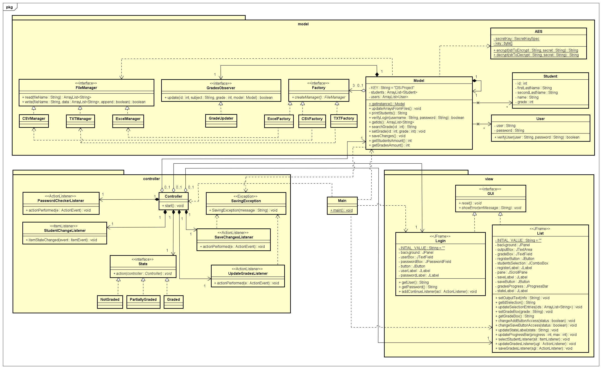

# Proyecto Final - Diseño de Software

## Profesor :man_teacher:

- M.C. Juan Francisco Garcilazo Ortiz

## Alumno :space_invader:

- Joshua Immanuel Meza Magaña

## Diagrama de clases :heavy_check_mark:

## Archivos :file_folder:

- [Main](./src/main/java/Main.java)
- [Model](./src/main/java/model/Model.java)
- [User](./src/main/java/model/User.java)
- [Student](./src/main/java/model/Student.java)
- [AES](./src/main/java/model/AES.java)
- [GradesObserver](./src/main/java/model/GradesObserver.java)
- [GradeUpdater](./src/main/java/model/GradeUpdater.java)
- [Factory](./src/main/java/model/Factory.java)
- [CSVFactory](./src/main/java/model/CSVFactory.java)
- [TXTFactory](./src/main/java/model/TXTFactory.java)
- [ExcelFactory](./src/main/java/model/ExcelFactory.java)
- [FileManager](./src/main/java/model/FileManager.java)
- [CSVManager](./src/main/java/model/CSVManager.java)
- [TXTManager](./src/main/java/model/TXTManager.java)
- [ExcelManager](./src/main/java/model/ExcelManager.java)
- [GUI](./src/main/java/view/GUI.java)
- [Login](./src/main/java/view/Login.java)
- [List](./src/main/java/view/List.java)
- [Controller](./src/main/java/controller/Controller.java)
- [SavingException](./src/main/java/controller/SavingException.java)
- [State](./src/main/java/controller/State.java)
- [NotGraded](./src/main/java/controller/NotGraded.java)
- [PartiallyGraded](./src/main/java/controller/PartiallyGraded.java)
- [Graded](./src/main/java/controller/Graded.java)

## Notas

- Desarrollado con Java SE 14
- Emplea las librería [Apache POI](https://poi.apache.org/download.html) `v5.0.0` para manejar los archivos Excel.

# Descargar JAR

[Clic aquí.](#)

